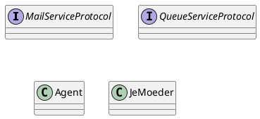

# Parking Permit Queue

This is a little app I made to track the position in the parking permit queue for Amsterdam. 

## Objectives 

- [x] Query and print position in queue 
- [x] Make command-line tool, that let's you run it, passing your license plate and client number 
- [x] Run continuously, and send e-mail upon change in position 
- [ ] Store position in SQL database for analysis 
- [ ] Deploy to cloud

## Structure 

